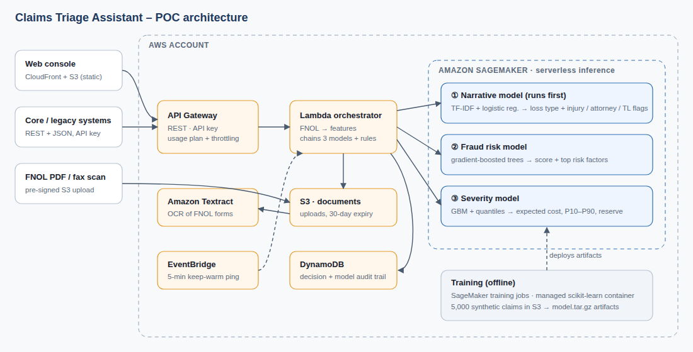

# Claims Triage Assistant: AWS SageMaker POC

A small, working proof of concept for a P&C insurer. A new claim comes in, either as JSON through an API or as a First Notice of Loss (FNOL) PDF. **Three machine-learning models hosted on Amazon SageMaker** analyze it, and the system returns a routing decision with plain-English reasons:

| Route | Meaning |
|---|---|
| `SIU_REFERRAL` | Refer to the Special Investigations Unit and hold payment |
| `COMPLEX_SENIOR_ADJUSTER` | Litigation, bodily injury or high severity: needs an experienced adjuster |
| `STANDARD_ADJUSTER` | Normal queue, with a suggested reserve |
| `FAST_TRACK` | Low risk, low cost: straight-through handling |

> All data is **synthetic**. The carrier ("Lakeside Mutual"), people and policies are fictitious.



## The three models

| # | Model | Input | Output | Hold-out metrics (synthetic data) |
|---|---|---|---|---|
| 1 | **Fraud risk**: gradient-boosted trees | 20+ structured FNOL fields | Probability, risk level, top 3 factors in plain English | AUC 0.94 · precision 74% in the top 5% of scores (base rate 11%) |
| 2 | **Severity / reserve**: GBM plus P10/P90 quantile models | Same fields | Expected incurred cost, likely range, reserve band | R² 0.87 (log $) · median error 30% · 79% of actuals inside P10–P90 |
| 3 | **Narrative / adjuster notes**: TF-IDF plus logistic regression | Free-text loss description, including shorthand such as *IV, CV, insd, LOR* | Loss category, injury / litigation / total-loss flags, key phrases | Category accuracy 93.5% · flag AUCs 0.98–0.997 |

The models run as a **chain**. The narrative model runs first, and its flags fill in any fields the form left blank before the fraud and severity models score the claim in parallel. **Transparent business rules** then combine all three outputs. Those rules are thresholds set in Lambda environment variables, so a claims VP can read and change them.

The metrics are deliberately *not* perfect. The synthetic data includes vague notes, typos, ambiguous losses and rough FNOL estimates, so the results look like real-world performance rather than a demo trick.

## Repository layout

```
data/            synthetic data generator, scenario definitions, 5,000-claim training set
ml/src/          the 3 models: one file each, used for SageMaker training AND serving
lambda/          orchestrator (API routes, FNOL→feature mapping, routing rules)
infra/           AWS CDK (Python): Foundation stack + App stack
web/             single-page console (served from CloudFront)
sample_docs/     17 FNOL PDFs + 2 faxed scans, JSON payloads, 200 hold-out claims
scripts/         train_in_sagemaker.py, smoke_test.py, local_demo.py
tests/           local end-to-end harness (no AWS needed)
docs/            architecture diagram, customer "kick the tires" guide
```

## Run it locally (no AWS account)

```bash
pip install -r requirements-dev.txt
for m in fraud severity notes; do python ml/src/${m}_model.py --model-dir build/model/$m; done
python tests/local_harness.py      # 17 scenarios × (JSON + PDF) + 200-claim hold-out batch
python scripts/local_demo.py       # console at http://localhost:8080 (any API key works)
```

Locally, SageMaker is replaced by the same model code running in-process, and Textract by a PDF text extractor. The two image-only `SCAN_` faxes therefore need the real AWS deployment, because they require OCR.

## Develop in VS Code

```bash
code .                                   # accept "Install recommended extensions"
python3 -m venv .venv && .venv/bin/pip install -r requirements-dev.txt -r infra/requirements.txt
```

Then pick the `.venv` interpreter when VS Code asks. Everything else is under **Terminal → Run Task…** or the **Run and Debug** panel:

| Task / launch config | What it does |
|---|---|
| Train all 3 models (local) | Writes `build/model/{fraud,severity,notes}` |
| Test: local harness | 17 scenarios × JSON + PDF, plus the 200-claim batch (expects 34/34) |
| Run: local demo | Console + API at http://localhost:8080 with the models in-process (breakpoints work in the Lambda code) |
| CDK: synth | Synthesizes both stacks (needs `npm i -g aws-cdk`) |
| AWS: deploy / smoke test / destroy | The AWS workflow below |

GitHub Actions (`.github/workflows/ci.yml`) runs on each push. It trains the models, runs the harness on current scikit-learn and again on the SageMaker container's pinned versions (Python 3.9, scikit-learn 1.2.1, pandas 1.1.3), and runs `cdk synth`.

Never commit credentials. `.env`, `*credentials*.csv` and `build/` (which holds `outputs.json`) are git-ignored.

## Deploy to AWS

Prerequisites: AWS CLI v2 with credentials for the target account, Python 3.10+ and Node 18+.

```bash
./deploy.sh                          # us-east-1, serverless endpoints
TRAINING=local ./deploy.sh           # new account with SageMaker training quota 0: train locally, host on SageMaker
AWS_REGION=us-east-2 ./deploy.sh
ENDPOINT_MODE=realtime ./deploy.sh   # always-on ml.t2.medium endpoints: no cold starts
python scripts/smoke_test.py         # every sample, end to end, against the live API
./destroy.sh                         # remove everything
```

`deploy.sh` does the following:

1. Deploys **ClaimsTriageFoundation**: an S3 artifact bucket and a least-privilege SageMaker role.
2. Runs **3 SageMaker training jobs** in parallel on the AWS-managed scikit-learn container (`scripts/train_in_sagemaker.py`, plain boto3 so the steps are visible).
3. Deploys **ClaimsTriageApp**: 3 SageMaker endpoints, Lambda, API Gateway (API key, usage plan, throttling), DynamoDB, the S3 document bucket (30-day expiry), EventBridge keep-warm, and the CloudFront console.
4. Prints the console URL, API URL and API key.

It takes roughly 20–25 minutes, and most of that is endpoint creation.

### Cost (approximate; check current AWS pricing)
- **Serverless mode (default):** you pay only for inference time, so it's a few dollars a month at demo volumes. The first call after a long idle period can take 30–60 s while the endpoints warm up. The EventBridge ping every 5 minutes and the console's **Wake models** button reduce that delay.
- **Realtime mode:** 3 × ml.t2.medium running around the clock, roughly $120 a month.
- **Textract:** about $1.50 per 1,000 pages. Training costs well under $1 per run.
- Lambda, API Gateway, DynamoDB and CloudFront are negligible at demo volumes.

## API

All routes require the header `x-api-key`. The base URL is the `ApiUrl` output (`…/v1/`).

| Method | Path | Purpose |
|---|---|---|
| GET | `/health?warm=1` | Endpoint status; `warm=1` wakes the serverless endpoints |
| POST | `/triage` | One claim object, or `{"claims": [...]}` with up to 50 claims |
| POST | `/documents` | `{"filename": "fnol.pdf"}` → pre-signed S3 upload URL |
| POST | `/documents/{id}/triage` | Textract, then triage the uploaded form |
| GET | `/claims` · `/claims/{triage_id}` | Decision history and full audit record |

```bash
curl -s -X POST "$API/triage" -H "x-api-key: $KEY" -H "Content-Type: application/json" \
     -d @sample_docs/claims/A03.json | jq '.route, .reasons'
```

## Design choices to discuss with the customer
- **Serverless inference** keeps an idle demo at nearly zero cost. For production, switch to realtime endpoints with autoscaling (a one-flag change).
- **API-first.** The console is only one client. Legacy core systems integrate through the same REST contract, and the FNOL-to-feature mapping in `claim_mapper.py` is where policy-admin lookups would go.
- **Explainability.** Every score comes with reasons, and every decision is stored with the full model output (DynamoDB) for audit and model-risk review.
- **Models are replaceable.** Each model is a standard SageMaker model behind its own endpoint. Swapping in XGBoost, a Hugging Face transformer or a vendor model doesn't touch the API.
- **Production hardening (not in the POC):** VPC endpoints, KMS CMKs, Cognito/SSO in place of API keys, WAF, SageMaker Model Monitor and a model registry, CI/CD, PII handling and redaction.
